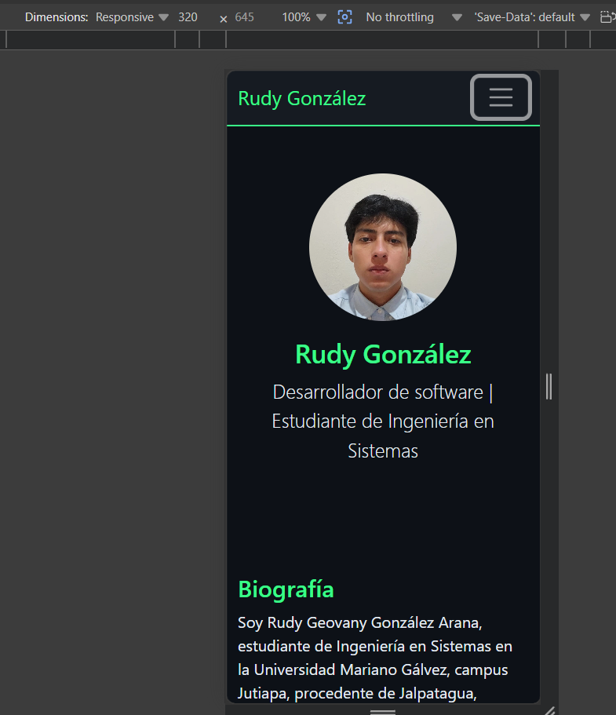
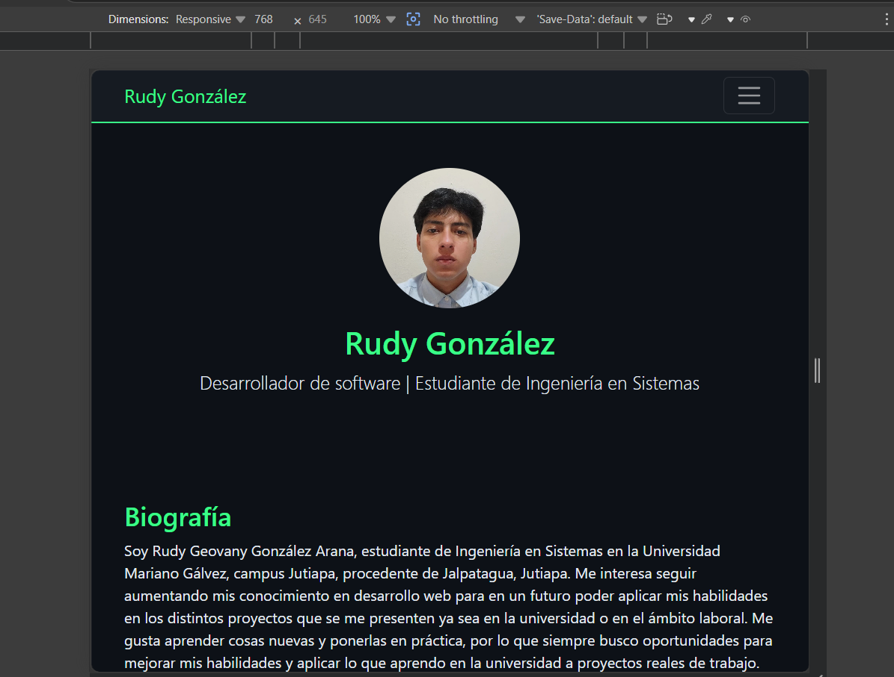
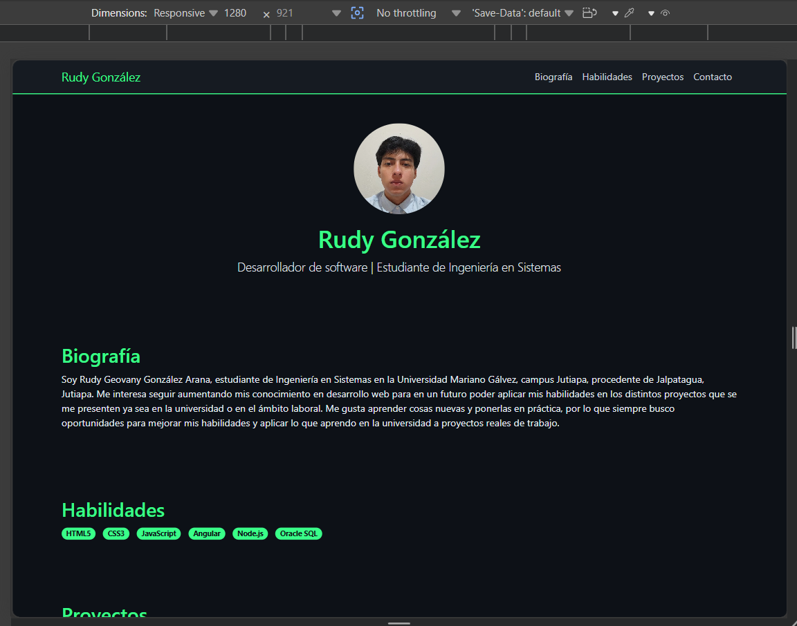

# Rudy González - Perfil Personal

## Objetivo
Página web de presentación personal desarrollada con Bootstrap 5,
aplicando HTML5 semántico, diseño responsive y personalización mediante CSS.

## Cómo ejecutar
1. Clona el repositorio
2. Abre `index.html` en cualquier navegador
3. No requiere instalación ni servidor

## Componentes de Bootstrap utilizados
- **Navbar** con colapso responsive (hamburguesa en móvil)
- **Cards** para mostrar proyectos con imagen, título y descripción
- **Badges con Rounded Pills** para listar habilidades
- **Grid system** (`container`, `row`, `col-md-4`) para layout responsive
- **Buttons** (`btn btn-primary`) para enlaces a GitHub y contacto

## Personalización en CSS (styles.css)
- Paleta de colores oscura estilo dev (`#0d1117`, `#161b22`)
- Color de acento verde terminal (`#39ff88`)
- Navbar personalizado con borde inferior verde
- Foto de perfil circular con tamaño controlado (`object-fit: cover`)
- Hover en enlaces del navbar con cambio de color
- Cards con fondo oscuro y borde de acento

## Decisiones de diseño
- Estilo visual "dark/dev" inspirado en editores de código
- Mobile-first: una columna en móvil, 3 columnas en desktop
- Sin uso de `!important` en ningún selector
- HTML5 semántico: `header`, `nav`, `section`, `footer`

## Capturas responsive
**320px (móvil):**

**768px (tablet):**

**1280px (desktop):**

